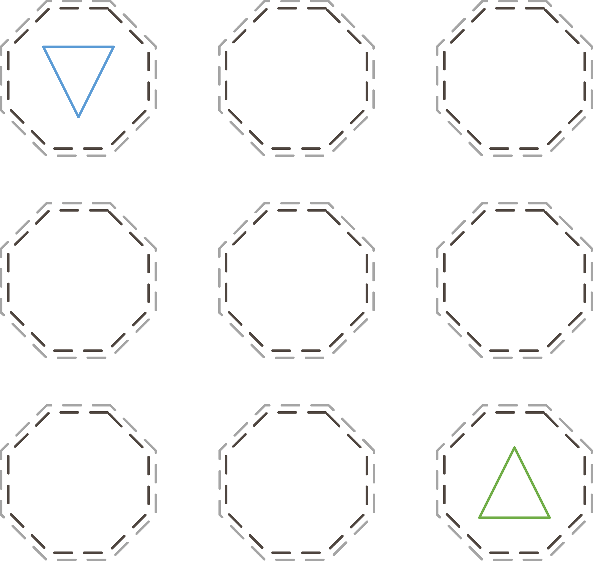
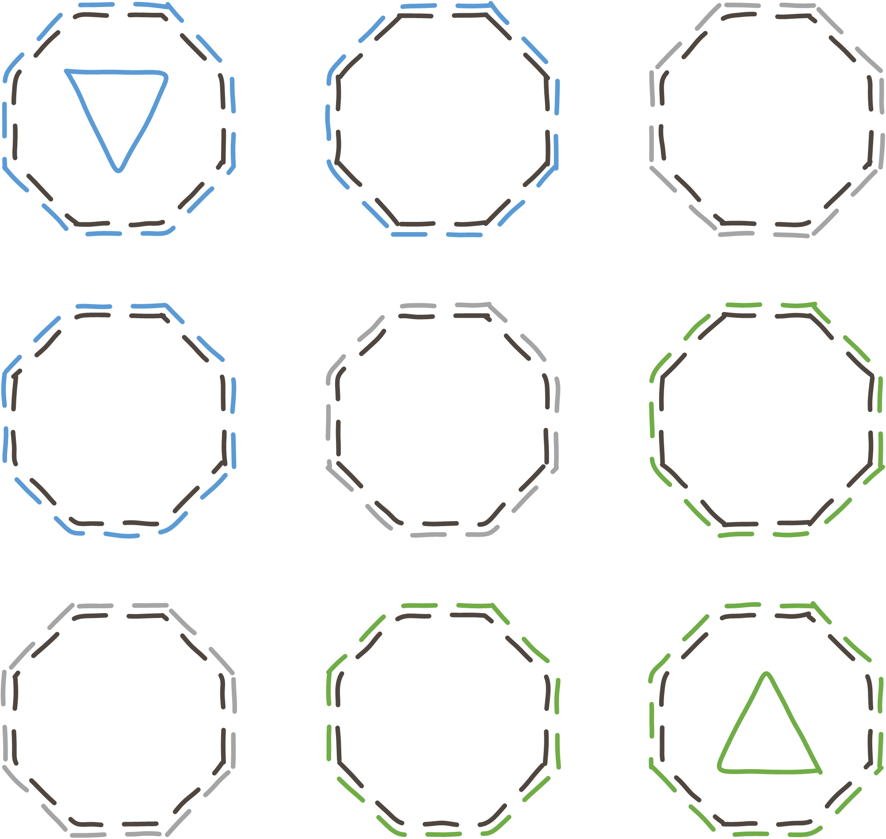
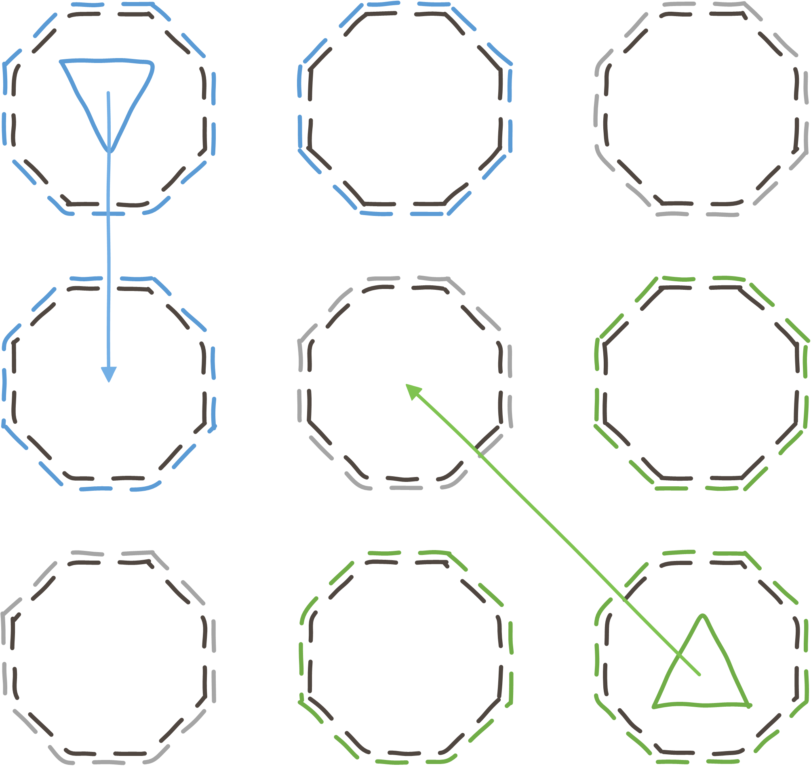
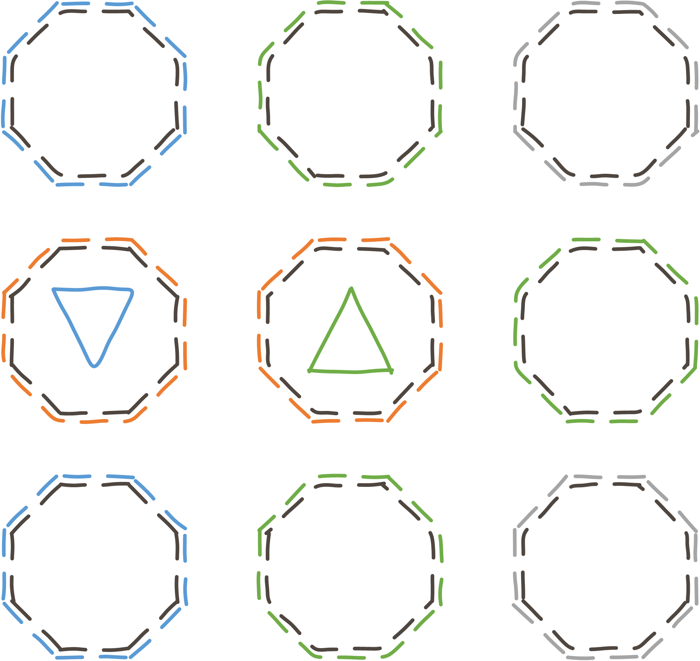

# Zelos

Zelos is a small toolbox aiming to provide tools for stratigic online games that does not requirer a server as trusted third party.
It tries to solve two problems
 + Ensure that hidden information can later be veryfied to prove a fair game
 + Provied a secure mechanism for a fog of war, without revealing informations.
 
## Acknowledgements

This small Project wouldn't be possible without Tim Wambach, a frind of mine. One week before christmas on a christmas market I talked with him
about my problem or better inability to implement some kind of fog of war. One that did not require a a trusted third party and
does not reveal any information. 

On the next day I got an mail with the solution. And I started this project.

## Details

Consider following scenario. A two player turnbased stratigic game played on a 3 x 3 map. Both players have one marker (blue and green).

A player knows only the position of his own marker. The other marker is invisible unless it comes in range of vision, which is 1 field (measured in manhatten distance).
So both players, who started in a corner, see olny 3 tiles. The tile they currently occupy and for the blue player the fields below and right and for the green player
the fields above and left from his position. Those fields have been marked in the color of the player.

Now both players plan there move. They may move only one field horizontal, vertical or diagonal. The green player moves to the center, while the blue Player moves down.

After Both playyers executed there move, they are next to each other. That means they also should know the position of each other.

The normal approach for a game played online is offten one of the following
 + Using a server
  - Knowing the complete gamestate but sending only informations that a player may know
  - Checking if a move the player made is valid
 + Using the client
  -Transmitting all data and rely on the client to show only the data the player may see.

I think the Problemms with the later are obvious. The former is in most cases sufficient. 
However your server needs to understand the game logic and calculate for every turn what data may be send and if the move a player made was valid.
This makes the server complexer. Also if you plan to have a more decentreliced server enviroment, where different persons running different servers,
the players also needs to trust those servers. A malicious player could work together with the person running the server
to gain addidional information.

Those two problems, to know the position of a player only if I may know it and to check if a move of a player was valid, solves Zelos without the need of a Server.

### Check if the player made a valid move

This project provides classes that let you reccord every move a player made and sends a hash of the move to his opponent. After the game both players exchange there reccords and
check if the other did cheat. For this they check if the move was vaild regarding the game rules and verify the hash.

A drawback of this method is that chating can only be discoverd after the game. A player could cheat to let a game progress infinitly. This way he can never win, but deny the victory of his opponent.

### Fog of War

The seccond part is to reveal information to the opponent in the middle of the game, if and only if he may know it. In this case the position of the opponent marker.

Briefly worded, every field is a number calculated using a random number (knwon by every one) and a secret exponent both players appliy resulting in the number of the field.
Now a player can ask his opponent if he has his marker on a field, without revealing what field he asks for. To do this he applies a seccond secrete exponent and sends this to his opponent.
Because the oponent does not know the exponent, he does not know wich filed the player asked for. Now the opponent uses the secreet exponent of the field where his
marker is positionied and removes this exponent. This results in a new number that does not hold any information for the player, unless he also removes both private exponets he previously applied.
If and only if this results in the originaly generated random number, this is the field with the oppnents marker.

In order not reveal information exedently over the number of probed fiels, this tool needs to be initilize with the maximum number of probes possible. Always asking this number of fields adding random data if he asks less.
If this is not done in the former example the blue player would have probed for 4 fields after his movement while the green player would have probed for 5. Revealing that the green player is in the center and the blue player
is on a edge and not a corner.

I will add a more detailed explonation with the actual math later.

The drawback of this method is that the cryptographic operations are expensive. Depending on the number of fields a player can maximal probe and the number on marker a player may have it can actually take secconds to calculate everything.
Network delay not included.

## Getting Started

Comming soon... *(written 29.12.2016)*